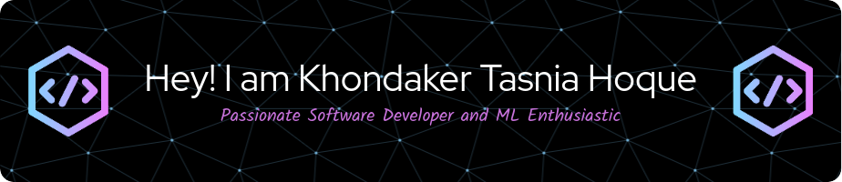

  

  

  

- 🔭 I’m currently working on [CodeWhisper](https://github.com/Tasnia16/AI-Project3.git)

- 🌱 I’m currently learning **Machine learning basics,React**

- 💬 Ask me about **Angular,Flutter,NodeJS,MongoDB**

- 📫 How to reach me **bsse1205@iit.du.ac.bd**

- ⚡ Fun fact **I need food at the time of late night coding !!**

<h3 align="left">Connect with me:</h3>

<h3 align="left">Languages and Tools:</h3>

                         

&nbsp;

